## 1、什么是单页面应用程

> 单页面应用程序（英文名：Single Page Application）简称 SPA，顾名 思义，指的是一个 Web 网站中只有唯一的一个 HTML 页面，所有的功能 与交互都在这唯一的一个页面内完成
>
> 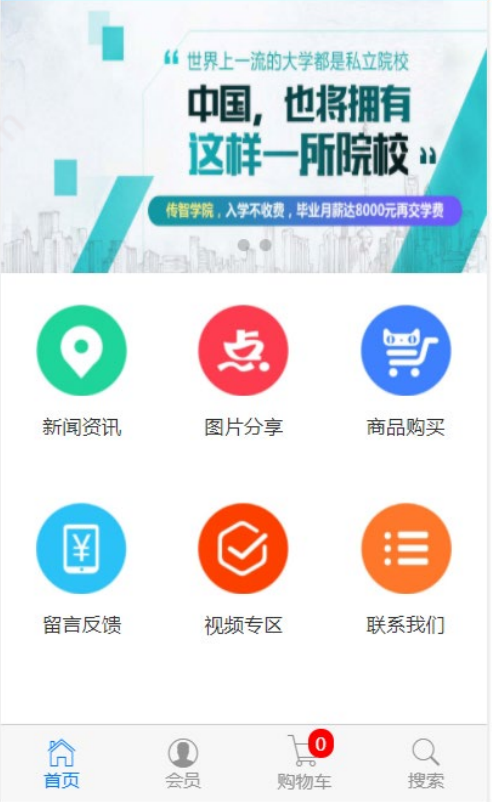

## 2. 什么是 vue-cli

> vue-cli 是 Vue.js 开发的标准工具。它简化了程序员基于 webpack 创建工程化的 Vue 项目的过程。 
>
> 引用自 vue-cli 官网上的一句话： 程序员可以专注在撰写应用上，而不必花好几天去纠结 webpack 配置的问题。 
>
> 中文官网：https://cli.vuejs.org/zh

## 3. 安装和使用

> vue-cli 是 npm 上的一个全局包，使用 npm install 命令，即可方便的把它安装到自己的电脑上： 
>
> `npm install -g @vue/cl`

> 基于 vue-cli 快速生成工程化的 Vue 项目
>
> `vue create 项目的名称`

## 4. vue 项目的运行流程

> 在工程化的项目中，vue 要做的事情很单纯：通过 main.js 把 App.vue 渲染到 index.html 的指定区域中
>
> 其中： 
>
> ① App.vue 用来编写待渲染的模板结构 
>
> ② index.html 中需要预留一个 el 区域 
>
> ③ main.js 把 App.vue 渲染到了 index.html 所预留的区域中

## vue 组件

#### 1. 什么是组件化开发

> 组件化开发指的是：根据封装的思想，把页面上可重用的 UI 结构封装为组件，从而方便项目的开发和维护

#### 2. vue 中的组件化开发

> vue 是一个支持组件化开发的前端框架。 
>
> vue 中规定：组件的后缀名是 .vue。之前接触到的 App.vue 文件本质上就是一个 vue 的组件。

#### 3. vue 组件的三个组成部分

> 每个 .vue 组件都由 3 部分构成，分别是： 
>
> * template -> 组件的模板结构 
> * script -> 组件的 JavaScript 行为 
> * style -> 组件的样式
>
> Tip: 其中，每个组件中必须包含 template 模板结构，而 script 行为和 style 样式是可选的组成部分

##### template

* vue 规定：每个组件对应的模板结构，需要定义到 

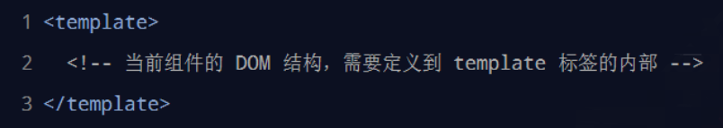

> Tip: 
>
> * template 是 vue 提供的容器标签，只起到包裹性质的作用，它不会被渲染为真正的 DOM 元素
> * template 中只能包含唯一的根节点

##### script

> vue 规定：开发者可以在 <script> 节点中封装组件的 JavaScript 业务逻辑

* <script> 节点的基本结构如下

##### .vue 组件中的 data 必须是函数

> vue 规定：.vue 组件中的 data 必须是一个函数，不能直接指向一个数据对象

* 因此在组件中定义 data 数据节点时，下面的方式是错误的：

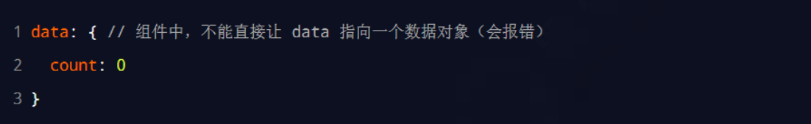

> Tip: 会导致多个组件实例共用同一份数据的问题

##### style

> vue 规定：组件内的 <style> 节点是可选的，开发者可以在 <style> 节点中编写样式美化当前组件的 UI 结构

* 基本结构如下

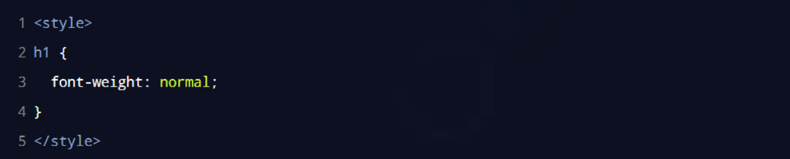

##### 让 style 中支持 less 语法

* 在 <style> 标签上添加 lang="less" 属性，即可使用 less 语法编写组件的样式：

#### 组件之间的父子关系

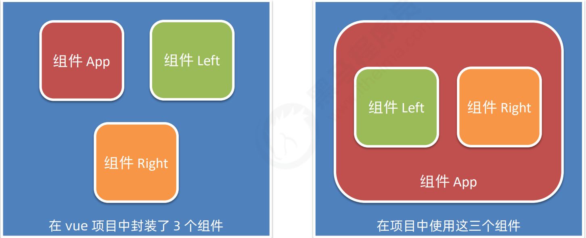

> Tip: 组件在被封装好之后，彼此之间是相互独立的，不存在父子关系 在使用组件的时候，根据彼此的嵌套关系，形成了<u>父子关系</u>、<u>兄弟关系</u>

##### 使用组件的三个步骤

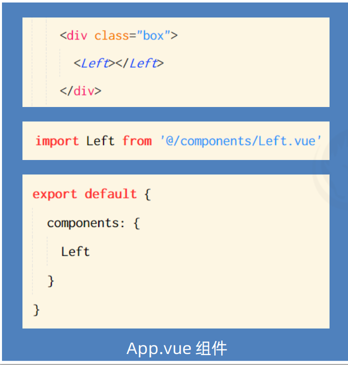

> 步骤1：使用 import 语法导入需要的组件
>
> 步骤2：使用 components 节点注册组件
>
> 步骤3：以标签形式使用刚才注册的组件

##### 通过 components 注册的是私有子组件

> 例如： 
>
> * 在组件 A 的 components 节点下，注册了组件 F。 
> * 则组件 F 只能用在组件 A 中；不能被用在组件 C 中。

##### 注册全局组件

* 在 vue 项目的 main.js 入口文件中，通过 Vue.component() 方法，可以注册全局组件。示例代码如下

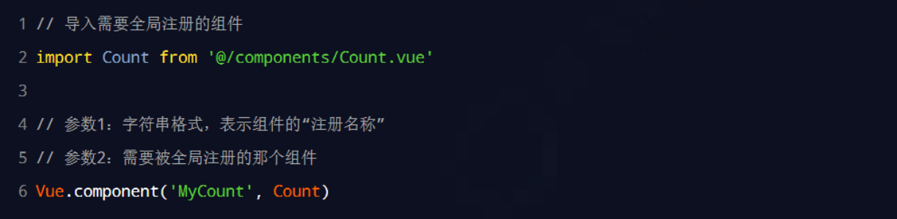

#### 组件的 props

> props 是组件的自定义属性，在封装通用组件的时候，合理地使用 props 可以极大的提高组件的复用性！

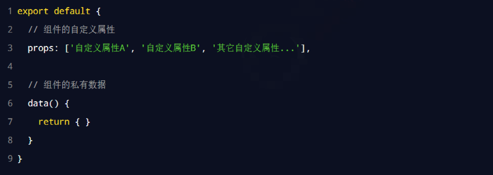

##### props 是只读的

* vue 规定：组件中封装的自定义属性是只读的，程序员不能直接修改 props 的值。否则会直接报错：

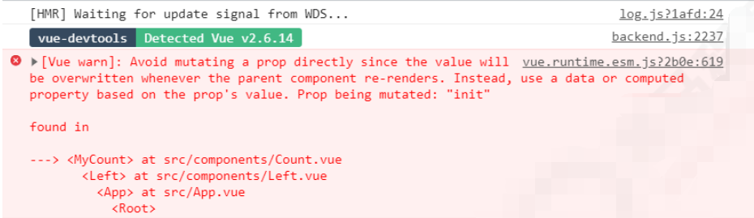

* 要想修改 props 的值，可以把 props 的值转存到 data 中，因为 data 中的数据都是可读可写的！

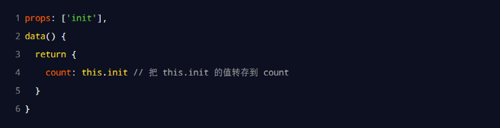

##### props 的 default 默认值

* 在声明自定义属性时，可以通过 default 来定义属性的默认值。示例代码如下：

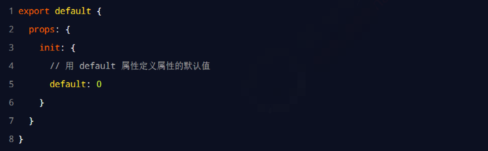

##### props 的 type 值类型

* 在声明自定义属性时，可以通过 type 来定义属性的值类型。示例代码如下：

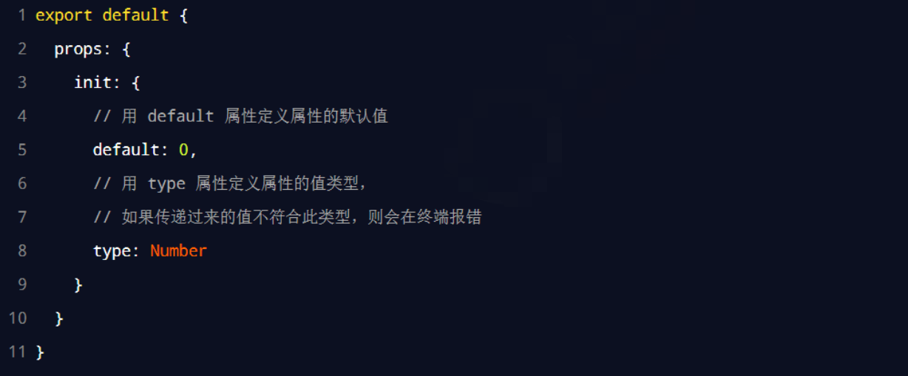

##### props 的 required 必填项

> 在声明自定义属性时，可以通过 required 选项，将属性设置为必填项，强制用户必须传递属性的值

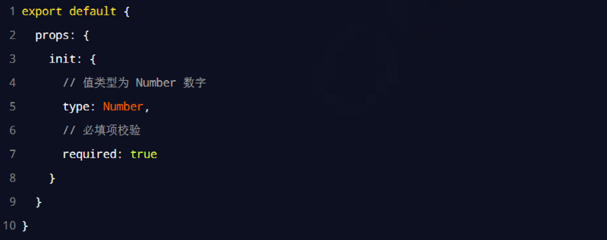

#### 组件之间的样式冲突问题

> 默认情况下，写在 .vue 组件中的样式会全局生效，因此很容易造成多个组件之间的样式冲突问题
>
> * 导致组件之间样式冲突的根本原因是：
>   * ① 单页面应用程序中，所有组件的 DOM 结构，都是基于唯一的 index.html 页面进行呈现的
>   * ② 每个组件中的样式，都会影响整个 index.html 页面中的 DOM 元素

#####  style 节点的 scoped 属性

* 为了提高开发效率和开发体验，vue 为 style 节点提供了 scoped 属性，从而防止组件之间的样式冲突问题：

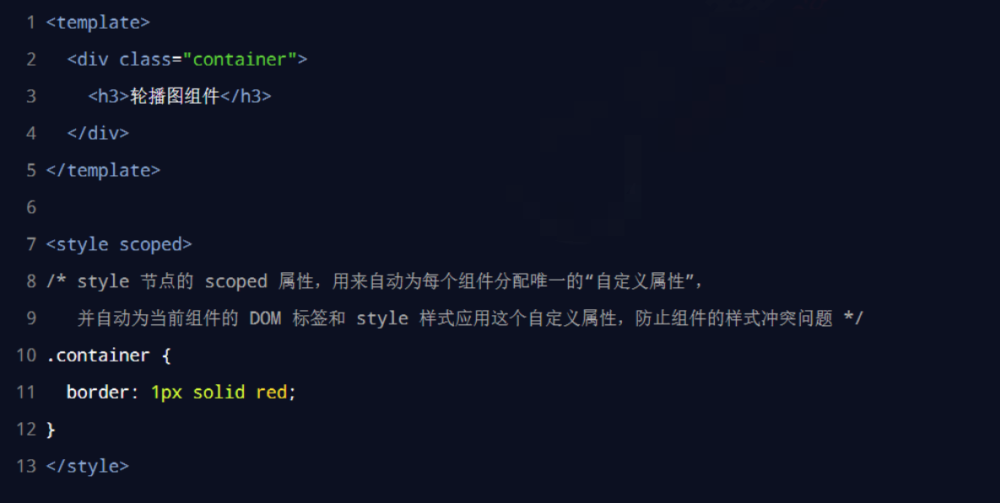

#####  /deep/ 样式穿透

* 如果给当前组件的 style 节点添加了 scoped 属性，则当前组件的样式对其子组件是不生效的。如果想让某些样 式对子组件生效，可以使用 /deep/ 深度选择器

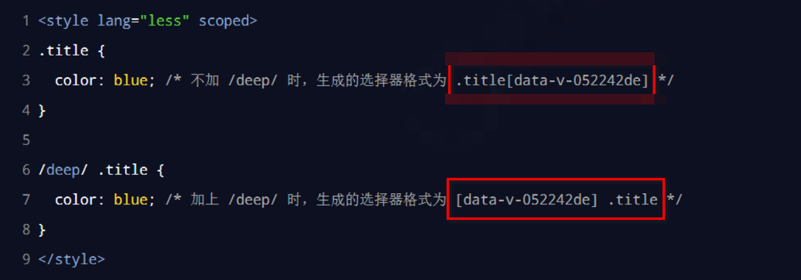