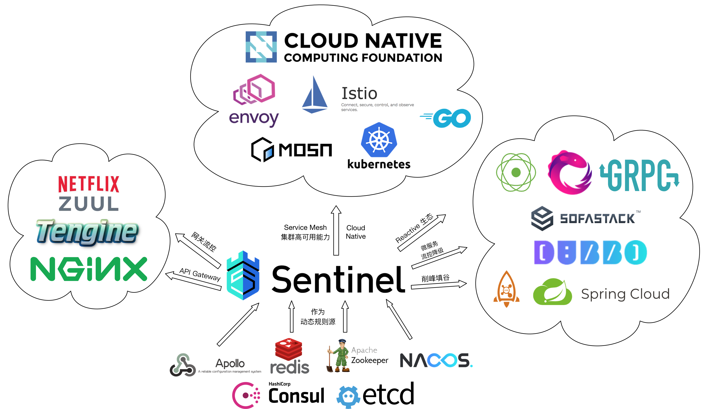

# 微服务常见概念

### 服务调用

将一个系统拆分成各个微服务后，各个微服务之间协同工作才能对外提供完整的服务，这就涉及到各个微服务之间的调用问题。目前各个微服务之间一般会采用Restful接口或者RPC协议的方式进行调用。

（1）Restful接口

Restful接口一般是基于HTTP协议实现的，这种协议使用上比较广泛，几乎所有的编程语言都支持HTTP协议。

（2）RPC协议

RPC是一种远程过程调用，能够做到像调用本地服务一样调用远程服务。RPC框架在底层屏蔽了数据的传输方式，序列化方式和交互的细节信息，让使用RPC框架开发微服务的人员觉得更加简单，实现起来更加容易。

### 服务治理

服务治理，说白了就是如何自动化的管理各个微服务，核心的功能就是服务的注册、发现和剔除。

（1）服务注册

各个微服务实例在启动时，能够将自身提供的服务注册到某个注册中心。

（2）服务发现

当某个微服务将自身提供的服务注册到注册中心时，其他微服务实例能够通过注册中心感知到这个微服务提供的服务，并且能够获取到这个微服务的实例信息，通过这个微服务的实例信息就能够调用这个微服务的方法，来进行相应的读写操作。

（3）服务剔除

如果某个微服务实例出现故障，或者连接一直超时，则注册中心会认为当前微服务实例不可用，就会将这个微服务实例剔除出注册中心，使其不再被其他微服务感知到和调用到。

### 注册中心

提供微服务注册、发现和剔除功能的服务组件。

### 服务网关

服务网关是所有微服务的入口，客户端在访问各个微服务时，首先需要经过服务网关。接入服务网关后，会将所有API的调用统一接入到API的网关层，由网关层统一接收参数进行路由转发，将返回的结果数据返回给客户端。

通常情况下，一个服务网关最基本的功能包括：统一接入、限流、熔断、降级、安全防护、协议适配、容错等等。主要专注的是对系统安全、流量和路由等的管理。这样，业务开发人员就可以专注于开发业务逻辑啦。

### 服务限流

在高并发大流量场景下，经常会出现某个服务或者接口因为调用的流量过大而导致不可用的情况，由于某个服务或者接口的不可用，可能还会导致整个系统崩溃。此时，就会对系统采取限流的手段来进行防护，当请求达到一定的频率或者速率时，对这些请求采取排队、等待、降级等策略，甚至是拒绝服务。

### 服务熔断

如果某个服务出现故障不可用，或者调用超时，为了不让其他服务受到牵累而导致整个系统不可用，则断开与这个服务的连接，暂停对这个服务的调用。

### 服务降级

服务降级主要是从整个系统的负载情况进行考虑，如果某些服务的负载情况比较高，则为了预防某些功能出现负载过高而导致响应慢的问题，会在提供这些功能的方法内部暂时舍弃对一些非核心功能接口的调用，直接返回一个提前准备好的错误处理信息。

服务降级是有损服务，但是能够保证整个系统的稳定性和可用性。

### 服务容错

服务容错指的是微服务能够容纳一定错误情况的发生。从某种意义上说，服务限流、服务熔断和服务降级都是服务容错的措施。

### 链路追踪

当系统被拆分成各个微服务后，一次请求往往会涉及到多个服务之间的调用关系。如果系统出现问题，则会增加定位问题的难度。为了解决这个问题，就需要对一次请求涉及到的多个服务链路的日志进行追踪和记录，一方面可以记录调用的链路，另一方面还可以监控系统中各个调用环节的性能，这就是链路追踪。

## SpringCloud Alibaba

SpringCloud Alibaba是阿里开源的一套微服务解决方案，包含各种微服务组件，能够极大的方便开发人员构建微服务应用。

### 主要功能

- **服务限流降级**：默认支持 WebServlet、WebFlux、OpenFeign、RestTemplate、Spring Cloud Gateway、Zuul、Dubbo 和 RocketMQ 限流降级功能的接入，可以在运行时通过控制台实时修改限流降级规则，还支持查看限流降级 Metrics 监控。
- **服务注册与发现**：适配 Spring Cloud 服务注册与发现标准，默认集成了 Ribbon 的支持。
- **分布式配置管理**：支持分布式系统中的外部化配置，配置更改时自动刷新。
- **消息驱动能力**：基于 Spring Cloud Stream 为微服务应用构建消息驱动能力。
- **分布式事务**：使用 @GlobalTransactional 注解， 高效并且对业务零侵入地解决分布式事务问题。
- **阿里云对象存储**：阿里云提供的海量、安全、低成本、高可靠的云存储服务。支持在任何应用、任何时间、任何地点存储和访问任意类型的数据。
- **分布式任务调度**：提供秒级、精准、高可靠、高可用的定时（基于 Cron 表达式）任务调度服务。同时提供分布式的任务执行模型，如网格任务。网格任务支持海量子任务均匀分配到所有 Worker（schedulerx-client）上执行。
- **阿里云短信服务**：覆盖全球的短信服务，友好、高效、智能的互联化通讯能力，帮助企业迅速搭建客户触达通道。

除了上述所具有的功能外，针对企业级用户的场景，Spring Cloud Alibaba 配套的企业版微服务治理方案 微服务引擎 MSE 还提供了企业级微服务治理中心，包括全链路灰度、服务预热、无损上下线和离群实例摘除等更多更强大的治理能力，同时还提供了企业级 Nacos 注册配置中心，企业级云原生网关等多种产品及解决方案。

### 组件

> - **[Sentinel (opens new window)](https://github.com/alibaba/Sentinel)**：把流量作为切入点，从流量控制、熔断降级、系统负载保护等多个维度保护服务的稳定性。
> - **[Nacos (opens new window)](https://github.com/alibaba/Nacos)**：一个更易于构建云原生应用的动态服务发现、配置管理和服务管理平台。
> - **[RocketMQ (opens new window)](https://rocketmq.apache.org/)**：一款开源的分布式消息系统，基于高可用分布式集群技术，提供低延时的、高可靠的消息发布与订阅服务。
> - **[Dubbo (opens new window)](https://github.com/apache/dubbo)**：Apache Dubbo™ 是一款高性能 Java RPC 框架。
> - **[Seata (opens new window)](https://github.com/seata/seata)**：阿里巴巴开源产品，一个易于使用的高性能微服务分布式事务解决方案。
> - **[Alibaba Cloud OSS (opens new window)](https://www.aliyun.com/product/oss)**: 阿里云对象存储服务（Object Storage Service，简称 OSS），是阿里云提供的海量、安全、低成本、高可靠的云存储服务。您可以在任何应用、任何时间、任何地点存储和访问任意类型的数据。
> - **[Alibaba Cloud SchedulerX (opens new window)](https://cn.aliyun.com/aliware/schedulerx)**: 阿里中间件团队开发的一款分布式任务调度产品，提供秒级、精准、高可靠、高可用的定时（基于 Cron 表达式）任务调度服务。
> - **[Alibaba Cloud SMS (opens new window)](https://www.aliyun.com/product/sms)**: 覆盖全球的短信服务，友好、高效、智能的互联化通讯能力，帮助企业迅速搭建客户触达通道。

注：SpringCloud Alibaba部分转载：https://github.com/alibaba/spring-cloud-alibaba/blob/2.2.x/README-zh.md


# 服务治理

## 实现服务的自动注册与发现

## 硬编码的问题

如果将用户微服务和商品微服务所在的IP地址和端口号硬编码到订单微服务中，会存在非常多的问题，其中，最明显的问题有三个，如下所示。

（1）如果用户微服务和商品微服务的IP地址或者端口号发生了变化，则订单微服务将变得不可用，需要对同步修改订单微服务中调用用户微服务和商品微服务的IP地址和端口号。

（2）如果系统中提供了多个用户微服务和商品微服务，则无法实现微服务的负载均衡功能。

（3）如果系统需要支持更高的并发，需要部署更多的用户微服务和商品微服务以及订单微服务，如果将用户微服务和商品微服务的IP地址和端口硬编码到订单微服务，则后续的维护会变得异常复杂。

所以，在微服务开发的过程中，需要引入服务治理功能，实现微服务之间的动态注册与发现。

## 服务治理

如果系统采用了微服务的架构模式，随着微服务数量的不断增多，服务之间的调用关系会变得纵横交错，以纯人工手动的方式来管理这些微服务以及微服务之间的调用关系是及其复杂的，也是极度不可取的。所以，需要引入服务治理的功能。服务治理也是在微服务架构模式下的一种最核心和最基本的模块，主要用来实现各个微服务的自动注册与发现。

引入服务治理后，微服务项目总体上可以分为三个大的模块：服务提供者、服务消费者和注册中心，三者的关系如下图所示。


（1）服务提供者会将自身提供的服务注册到注册中心，并向注册中心发送心跳信息来证明自己还存活，其中，心跳信息中就会包含服务提供者自身提供的服务信息。

（2）注册中心会存储服务提供者上报的信息，并通过服务提供者发送的心跳来更新服务提供者最后的存活时间，如果超过一段时间没有收到服务提供者上报的心跳信息，则注册中心会认为服务提供者不可用，会将对应的服务提供者从服务列表中剔除。

（3）服务消费者会向注册中心订阅自身监听的服务，注册中心会保存服务消费者的信息，也会向服务消费者推送服务提供者的信息。

（4）服务消费者从注册中心获取到服务提供者的信息时，会直接调用服务提供者的接口来实现远程调用。

**这里需要注意的是：服务消费者一般会从注册中心中获取到所有服务提供者的信息，根据具体情况实现对具体服务提供者的实例进行访问。**

## 注册中心

从上面的分析可以看出，微服务实现服务治理的关键就是引入了注册中心，它是微服务架构模式下一个非常重要的组件，主要实现了服务注册与发现，服务配置和服务的健康检测等功能。

### 服务注册与发现

（1）服务注册：注册中心提供保存服务提供者和服务消费者的相关信息。

（2）服务发现：也可以理解为服务订阅，服务调用者也就是服务消费者，向注册中心订阅服务提供者的信息，注册中心会向服务消费者推送服务提供者的信息。

### 服务配置

（1）配置订阅：服务的提供者和消费者都可以向注册中心订阅微服务相关的配置信息。

（2）配置下发：注册中心能够将微服务相关的配置信息主动推送给服务的提供者和消费者。

### 服务健康检测

注册中心会定期检测存储的服务列表中服务提供者的健康状况，例如服务提供者超过一定的时间没有上报心跳信息，则注册中心会认为对应的服务提供者不可用，就会将服务提供者踢出服务列表。

### 常见的注册中心

能够实现注册中心功能的组件有很多，但是常用的组件大概包含：Zookeeper、Eureka、Consul、Etcd、Nacos等。这里，就给大家简单介绍下这些能够实现注册中心功能的框架或组件。

**（1）Zookeeper**

接触过分布式或者大数据开发的小伙伴应该都知道，Zookeeper是Apache Hadoop的一个子项目，它是一个分布式服务治理框架，主要用来解决应用开发中遇到的一些数据管理问题，例如：分布式集群管理、元数据管理、分布式配置管理、状态同步和统一命名管理等。在高并发环境下，也可以通过Zookeeper实现分布式锁功能。

**（2）Eureka**

Eureka是Netflix开源的SpringCloud中支持服务注册与发现的组件，但是后来闭源了。

**（3）Consul**

Consul 是 HashiCorp 公司推出的开源产品，用于实现分布式系统的服务发现、服务隔离、服务配置，这些功能中的每一个都可以根据需要单独使用，也可以同时使用所有功能。

**（4）Etcd**

etcd 是一个高度一致的分布式键值存储，它提供了一种可靠的方式来存储需要由分布式系统或机器集群访问的数据。它可以优雅地处理网络分区期间的领导者选举，即使在领导者节点中也可以容忍机器故障。

**（5）Nacos**

这里，我们重点说下Nacos。Nacos是阿里巴巴开源的一款更易于构建云原生应用的支持动态服务发现、配置管理和服务管理的平台，其提供了一组简单易用的特性集，能够快速实现动态服务发现、服务配置、服务元数据及流量管理，主要如下所示。

- 服务注册：Nacos Client会通过发送REST请求的方式向Nacos Server注册自己的服务，提供自身的元数据，比如IP地址、端口等信 息。Nacos Server接收到注册请求后，就会把这些元数据信息存储在一个双层的内存Map中。
- 服务心跳：在服务注册后，Nacos Client会维护一个定时心跳来持续通知Nacos Server，说明服务一直处于可用状态，防止被剔除。默认5s发送一次心跳。
- 服务健康检查：Nacos Server会开启一个定时任务用来检查注册服务实例的健康情况，对于超过15s没有收到客户端心跳的实例会将它的healthy属性置为false(客户端服务发现时不会发现)，如果某个实例超过30秒没有收到心跳，直接剔除该实例(被剔除的实例如果恢复发送心跳则会重新注册)
- 服务发现：服务消费者（Nacos Client）在调用服务提供者的服务时，会发送一个REST请求给Nacos Server，获取上面注册的服务清 单，并且缓存在Nacos Client本地，同时会在Nacos Client本地开启一个定时任务定时拉取服务端最新的注册表信息更新到本地存。
- 服务同步：Nacos Server集群之间会互相同步服务实例，用来保证服务信息的一致性。

这里，我们选用的注册中心就是阿里巴巴开源的Nacos。


# 服务容错

## 服务雪崩

系统采用分布式或微服务的架构模式后，由于网络或者服务自身的问题，一般服务是很难做到100%高可用的。如果一个服务出现问题，就可能会导致其他的服务级联出现问题，这种故障性问题会在整个系统中不断扩散，进而导致服务不可用，甚至宕机，最终会对整个系统造成灾难性后果。

## 服务容错方案

服务容错在一定程度上就是尽最大努力来兼容错误情况的发生，因为在分布式和微服务环境中，不可避免的会出现一些异常情况，我们在设计分布式和微服务系统时，就要考虑到这些异常情况的发生，使得系统具备服务容错能力。

常见的服务错误方案包含：服务限流、服务隔离、服务超时、服务熔断和服务降级等。

### 服务限流

服务限流就是限制进入系统的流量，以防止进入系统的流量过大而压垮系统。其主要的作用就是保护服务节点或者集群后面的数据节点，防止瞬时流量过大使服务和数据崩溃（如前端缓存大量实效），造成不可用；还可用于平滑请求。

限流算法有两种，一种就是简单的请求总量计数，一种就是时间窗口限流（一般为1s），如令牌桶算法和漏牌桶算法就是时间窗口的限流算法。

### 服务隔离

服务隔离有点类似于系统的垂直拆分，就按照一定的规则将系统划分成多个服务模块，并且每个服务模块之间是互相独立的，不会存在强依赖的关系。如果某个拆分后的服务发生故障后，能够将故障产生的影响限制在某个具体的服务内，不会向其他服务扩散，自然也就不会对整体服务产生致命的影响。

互联网行业常用的服务隔离方式有：线程池隔离和信号量隔离。

### 服务超时

整个系统采用分布式和微服务架构后，系统被拆分成一个个小服务，就会存在服务与服务之间互相调用的现象，从而形成一个个调用链。形成调用链关系的两个服务中，主动调用其他服务接口的服务处于调用链的上游，提供接口供其他服务调用的服务处于调用链的下游。

服务超时就是在上游服务调用下游服务时，设置一个最大响应时间，如果超过这个最大响应时间下游服务还未返回结果，则断开上游服务与下游服务之间的请求连接，释放资源。

### 服务熔断

在分布式与微服务系统中，如果下游服务因为访问压力过大导致响应很慢或者一直调用失败时，上游服务为了保证系统的整体可用性，会暂时断开与下游服务的调用连接。这种方式就是熔断。

服务熔断一般情况下会有三种状态：关闭、开启和半熔断。

- 关闭状态：服务一切正常，没有故障时，上游服务调用下游服务时，不会有任何限制。
- 开启状态：上游服务不再调用下游服务的接口，会直接返回上游服务中预定的方法。
- 半熔断状态：处于开启状态时，上游服务会根据一定的规则，尝试恢复对下游服务的调用。此时，上游服务会以有限的流量来调用下游服务，同时，会监控调用的成功率。如果成功率达到预期，则进入关闭状态。如果未达到预期，会重新进入开启状态。

### 服务降级

服务降级，说白了就是一种服务托底方案，如果服务无法完成正常的调用流程，就使用默认的托底方案来返回数据。例如，在商品详情页一般都会展示商品的介绍信息，一旦商品详情页系统出现故障无法调用时，会直接获取缓存中的商品介绍信息返回给前端页面。

## Sentinel

### Sentinel的特征

- **丰富的应用场景**：Sentinel 承接了阿里巴巴近 10 年的双十一大促流量的核心场景，例如秒杀（即突发流量控制在系统容量可以承受的范围）、消息削峰填谷、集群流量控制、实时熔断下游不可用应用等。
- **完备的实时监控**：Sentinel 同时提供实时的监控功能。您可以在控制台中看到接入应用的单台机器秒级数据，甚至 500 台以下规模的集群的汇总运行情况。
- **广泛的开源生态**：Sentinel 提供开箱即用的与其它开源框架/库的整合模块，例如与 Spring Cloud、Apache Dubbo、gRPC、Quarkus 的整合。您只需要引入相应的依赖并进行简单的配置即可快速地接入 Sentinel。同时 Sentinel 提供 Java/Go/C++ 等多语言的原生实现。
- **完善的 SPI 扩展机制**：Sentinel 提供简单易用、完善的 SPI 扩展接口。您可以通过实现扩展接口来快速地定制逻辑。例如定制规则管理、适配动态数据源等。

### Sentinel的主要特性


### Sentinel的开源生态



Sentinel 分为两个部分:

- 核心库（Java 客户端）不依赖任何框架/库，能够运行于所有 Java 运行时环境，同时对 Dubbo / Spring Cloud 等框架也有较好的支持。
- 控制台（Dashboard）基于 Spring Boot 开发，打包后可以直接运行，不需要额外的 Tomcat 等应用容器

注意：上述内容来自Sentinel官方文档，链接地址为：[https://github.com/alibaba/Sentinel/wiki/%E4%BB%8B%E7%BB%8D](https://github.com/alibaba/Sentinel/wiki/介绍)


## Sentinel核心技术与配置规则

随着微服务的流行，服务和服务之间的稳定性变得越来越重要。Sentinel 以流量为切入点，从流量控制、熔断降级、系统负载保护等多个维度保护服务的稳定性。所以，Sentinel的核心功能包括：**流量控制、熔断降级、系统负载保护**。

### 流量控制

在高并发、大流量场景下，进入系统的流量如果不加控制的话，系统就很有可能会被流量压垮。所以，在流量正式进入系统之前，需要对流量进行控制，以便使流量均匀、可控的方式进入系统。

Sentinel作为一个非常出色的容错组件，能够将不可控的流量经过处理转化成均匀、可控的流量。

### 熔断降级

如果检测到系统中的某个调用链路中某个节点出现故障，比如请求超时、服务宕机或者异常比超出一定阈值时，就会对出现故障的节点的调用频率进行限制，甚至不调用出现故障的节点，让请求能够快速失败并返回，以最大程度避免影响到其他节点的服务而导致系统的级联故障。

Sentinel主要通过 **限制并发线程数和响应时间** 对资源的访问进行降级。

**1.限制并发线程数进行降级**

Sentinel可以通过限制服务节点的并发线程数量，来减少对其他服务节点的影响。例如，当某个服务节点出现故障，例如响应时间变长，或者直接宕机。此时，对服务的直接影响就是会造成请求线程数的不断堆积。如果这些堆积的线程数达到一定的数量后，对当前服务节点的后续请求就会被拒绝，等到堆积的线程完成任务后再开始继续接收新的请求。

**2.通过响应时间进行降级**

Sentinel除了可以通过限制并发线程数进行降级外，也能够通过响应时间进行降级。如果依赖的服务出现响应时间过长的情况，则所有对该服务的请求都会被拒绝，直到过了指定的时间窗口之后才能再次访问该服务。

### 系统负载保护

Sentinel提供了系统维度的自适应保护能力。当系统的压力和负载比较高的时候，如果还持续让大量的请求进入系统，此时就有可能将系统压垮，进而导致系统宕机。Sentinel会在集群环境下，将本应服务器A承载的流量转发到其他服务器上，比如转发到服务器B上。如果此时服务器B也处于高负载的状态，则Sentinel会提供相应的保护机制，让系统的入口流量和系统的整体负载达到平衡，让系统整体可用，并且能够最大限度的处理请求。

## Sentinel核心规则

Sentinel的核心规则包括流控规则、熔断规则、热点规则、授权规则和系统规则，每种规则的配置方式不同。接下来，就详细介绍下Sentinel中的每种规则的作用与效果。


## 流控规则

Sentinel能够对流量进行控制，主要是监控应用的QPS流量或者并发线程数等指标，如果达到指定的阈值时，就会被流量进行控制，以避免服务被瞬时的高并发流量击垮，保证服务的高可靠性。


# 服务网关：网关概述与核心架构

## 网关概述

当采用分布式、微服务的架构模式开发系统中，服务网关是整个系统中必不可少的一部分。

### 没有网关的弊端

当一个系统使用分布式、微服务架构后，系统会被拆分为一个个小的微服务，每个微服务专注一个小的业务。那么，客户端如何调用这么多微服务的接口呢？如果不做任何处理，没有服务网关，就只能在客户端记录下每个微服务的每个接口地址，然后根据实际需要去调用相应的接口。


这种直接使用客户端记录并管理每个微服务的每个接口的方式，存在着太多的问题。比如，这里我列举几个常见的问题。

- 由客户端记录并管理所有的接口缺乏安全性。
- 由客户端直接请求不同的微服务，会增加客户端程序编写的复杂性。
- 涉及到服务认证与鉴权规则时，需要在每个微服务中实现这些逻辑，增加了代码的冗余性。
- 客户端调用多个微服务，由于每个微服务可能部署的服务器和域名不同，存在跨域的风险。
- 当客户端比较多时，每个客户端上都管理和配置所有的接口，维护起来相对比较复杂。

### 引入API网关

API网关，其实就是整个系统的统一入口。网关会封装微服务的内部结构，为客户端提供统一的入口服务，同时，一些与具体业务逻辑无关的通用逻辑可以在网关中实现，比如认证、授权、路由转发、限流、监控等。引入API网关后，如下所示。


可以看到，引入API网关后，客户端只需要连接API网关，由API网关根据实际情况进行路由转发，将请求转发到具体的微服务，同时，API网关会提供认证、授权、限流和监控等功能。

## 主流的API网关

当系统采用分布式、微服务的架构模式后，API网关就成了整个系统不可分割的一部分。业界通过不断的探索与创新，实现了多种API网关的解决方案。目前，比较主流的API网关有：Nginx+Lua、Kong官网、Zuul网关、Apache Shenyu网关、SpringCloud Gateway网关。

### Nginx+Lua

Nginx的一些插件本身就实现了限流、缓存、黑白名单和灰度发布，再加上Nginx的反向代理和负载均衡，能够实现对服务接口的负载均衡和高可用。而Lua语言可以实现一些简单的业务逻辑，Nginx又支持Lua语言。所以，可以基于Nginx+Lua脚本实现网关。

### Kong网关

Kong网关基于Nginx与Lua脚本开发，性能高，比较稳定，提供多个限流、鉴权等插件，这些插件支持热插拔，开箱即用。Kong网关提供了管理页面，但是，目前基于Kong网关二次开发比较困难。

### Zuul网关

Zuul网关是Netflix开源的网关，功能比较丰富，主要基于Java语言开发，便于在Zuul网关的基础上进行二次开发。但是Zuul网关无法实现动态配置规则，依赖的组件相对来说也比较多，在性能上不如Nginx。

### Apache Shenyu网关

Dromara社区开发的网关框架，ShenYu 的前名是 soul，最近正式加入了 Apache 的孵化器，因此改名为 ShenYu。其是一个异步的，高性能的，跨语言的，响应式的API网关，并在此基础上提供了非常丰富的扩展功能：

- 支持各种语言(http协议)，支持Dubbo, Spring-Cloud, Grpc, Motan, Sofa, Tars等协议。
- 插件化设计思想，插件热插拔，易扩展。
- 灵活的流量筛选，能满足各种流量控制。
- 内置丰富的插件支持，鉴权，限流，熔断，防火墙等等。
- 流量配置动态化，性能极高。
- 支持集群部署，支持 A/B Test，蓝绿发布。

### SpringCloud Gateway网关

Spring为了替换Zuul而开发的网关，SpringCloud Alibaba技术栈中，并没有单独实现网关的组件。在后续的案例实现中，我们会使用SpringCloud Gateway实现网关功能。

## SpringCloud Gateway网关

Spring Cloud Gateway是Spring公司基于Spring 5.0， Spring Boot 2.0 和 Project Reactor 等技术开发的网关，它旨在为微服务架构提供一种简单有效的统一的 API 路由管理方式。它的目标是替代Netflix Zuul，其不仅提供统一的路由方式，并且基于 Filter 链的方式提供了网关基本的功能，例如：安全，监控和限流、重试等。

### SpringCloud Gateway概述

Spring Cloud Gateway是Spring Cloud的一个全新项目，基于Spring 5.0 + Spring Boot 2.0和Project Reactor等技术开发的网关，它旨在为微服务架构提供一种简单有效的统一的API路由管理方式。Spring Cloud Geteway作为Spring Cloud生态系统中的网关，目标是替代Zuul，在Spring Cloud2.0以上版本中，没有对新版本的Zuul 2.0以上最新高性能版本进行集成，仍然还是使用的Zuul 1.x非Reactor模式的老版本。而为了提升网关性能，Spring Cloud Gateway是基于WebFlux框架实现的，而WebFlux框架底层则使用了高性能的Reactor模式通信框架Netty。

Spring Cloud Gateway的目标提供统一的路由方式且基于Filter链的方式提供了网关基本的功能，例如：安全，监控/指标，和限流。

**总结一句话：Spring Cloud Gateway使用的Webflux中的reactor-netty响应式编程组件，底层使用Netty通讯框架。**

### SpringCloud Gateway核心架构

客户端请求到 Gateway 网关，会先经过 Gateway Handler Mapping 进行请求和路由匹配。匹配成功后再发送到 Gateway Web Handler 处理，然后会经过特定的过滤器链，经过所有前置过滤后，会发送代理请求。请求结果返回后，最后会执行所有的后置过滤器。


由上图可以看出，SpringCloud Gateway的主要流程为：客户端请求会先打到Gateway，具体的讲应该是DispacherHandler（因为Gateway引入了WebFlux，作用可以类比MVC的DispacherServlet），Gateway根据用户的请求找到相应的HandlerMapping，请求和具体的handler之间有一个映射关系，网关会对请求进行路由，handler会匹配到RoutePredicateHandlerMapping，匹配请求对应的Route，然后到达Web处理器，WebHandler代理了一系列网关过滤器和全局过滤器的实例，这些过滤器可以对请求和响应进行修改，最后由代理服务完成用户请求，并将结果返回。

> 注：SpringCloud Gateway部分参考链接：
>
> https://www.csdn.net/tags/NtTagg0sMTk1OTItYmxvZwO0O0OO0O0O.html
>
> https://baijiahao.baidu.com/s?id=1685753662803832483


## SpringCloud Gateway核心技术

SpringCloud Gateway能够实现多种网关功能，比如路由转发、断言、过滤器、熔断、限流、降级、自定义谓词配置、自定义过滤器等等多种功能。今天，我们就一起来聊聊SpringCloud Gateway中的断言、过滤器与熔断机制。

## 网关断言

断言的英文是Predicate，也可以翻译成谓词。主要的作用就是进行条件判断，可以在网关中实现多种条件判断，只有所有的判断结果都通过时，也就是所有的条件判断都返回true，才会真正的执行路由功能。

### SpringCloud Gateway内置断言

SpringCloud Gateway包括许多内置的断言工厂，所有这些断言都与HTTP请求的不同属性匹配。

#### 基于日期时间类型的断言

基于日期时间类型的断言根据时间做判断，主要有三个：

- AfterRoutePredicateFactory： 接收一个日期参数，判断请求日期是否晚于指定日期
- BeforeRoutePredicateFactory： 接收一个日期参数，判断请求日期是否早于指定日期
- BetweenRoutePredicateFactory： 接收两个日期参数，判断请求日期是否在指定时间段内

#### 使用示例

```bash
- After=2022-05-10T23:59:59.256+08:00[Asia/Shanghai]
 
         
    
```


#### 基于远程地址的断言

RemoteAddrRoutePredicateFactory：接收一个IP地址段，判断请求主机地址是否在地址段中。

#### 使用示例

```bash
- RemoteAddr=192.168.0.1/24
```


#### 基于Cookie的断言

CookieRoutePredicateFactory：接收两个参数， cookie 名字和一个正则表达式。 判断请求cookie是否具有给定名称且值与正则表达式匹配。

#### 使用示例

```bash
- Cookie=name, binghe.
```


#### 基于Header的断言

HeaderRoutePredicateFactory：接收两个参数，标题名称和正则表达式。 判断请求Header是否具有给定名称且值与正则表达式匹配。

#### 使用示例

```bash
- Header=X-Request-Id, \d+
```


#### 基于Host的断言

HostRoutePredicateFactory：接收一个参数，主机名模式。判断请求的Host是否满足匹配规则。

#### 使用示例

```bash
- Host=**.binghe.com
```


#### 基于Method请求方法的断言

MethodRoutePredicateFactory：接收一个参数，判断请求类型是否跟指定的类型匹配。

#### 使用示例

```bash
- Method=GET
```


#### 基于Path请求路径的断言

PathRoutePredicateFactory：接收一个参数，判断请求的URI部分是否满足路径规则。

#### 使用示例

```bash
- Path=/binghe/{segment}
```


#### 基于Query请求参数的断言

QueryRoutePredicateFactory ：接收两个参数，请求参数和正则表达式， 判断请求参数是否具有给定名称且值与正则表达式匹配。

#### 使用示例

```bash
- Query=name, binghe.
```


#### 基于路由权重的断言

WeightRoutePredicateFactory：接收一个[组名,权重], 然后对于同一个组内的路由按照权重转发。

#### 使用示例

```bash
- id: weight1
  uri: http://localhost:8080
  predicates:
    - Path=/api/**
    - Weight=group1,2
  filters:
    - StripPrefix=1
- id: weight2
  uri: http://localhost:8081
  predicates:
    - Path=/api/**
    - Weight=group1,8
  filters:
    - StripPrefix=1
```


### 演示内置断言

在演示的示例中，我们基于Path请求路径的断言判断请求路径是否符合规则，基于远程地址的断言判断请求主机地址是否在地址段中，并且限制请求的方式为GET方式。整个演示的过程以访问用户微服务的接口为例。

（1）由于在开发项目时，所有的服务都是在我本地启动的，首先查看下我本机的IP地址，如下所示。


可以看到，我本机的IP地址为192.168.0.27，属于192.168.0.1/24网段。

（2）在服务网关模块shop-gateway中，将application.yml文件备份成application-sentinel.yml文件，并将application.yml文件中的内容修改成application-simple.yml文件中的内容。接下来，在application.yml文件中的`spring.cloud.gateway.routes`节点下的`- id: user-gateway`下面进行断言配置，配置后的结果如下所示。

```yaml
spring:
  cloud:
    gateway:
      routes:
        - id: user-gateway
          uri: http://localhost:8060
          order: 1
          predicates:
            - Path=/server-user/**
            - RemoteAddr=192.168.0.1/24
            - Method=GET
          filters:
            - StripPrefix=1
```


**注意：完整的配置参见案例完整源代码。**

（3）配置完成后启动用户微服务和网关服务，通过网关服务访问用户微服务，在浏览器中输入`http://localhost:10001/server-user/user/get/1001`，如下所示。


可以看到通过`http://localhost:10001/server-user/user/get/1001`链接不能正确访问到用户信息。

接下来，在浏览器中输入`http://192.168.0.27:10001/server-user/user/get/1001`，能够正确获取到用户的信息。


（4）停止网关微服务，将基于远程地址的断言配置成`- RemoteAddr=192.168.1.1/24`，也就是将基于远程地址的断言配置成与我本机IP地址不在同一个网段，这样就能演示请求主机地址不在地址段中的情况，修改后的基于远程地址的断言配置如下所示。

```bash
- RemoteAddr=192.168.1.1/24
 
         
    
```

1

（5）重启网关服务，再次在浏览器中输入`http://localhost:10001/server-user/user/get/1001`，如下所示。


可以看到通过`http://localhost:10001/server-user/user/get/1001`链接不能正确访问到用户信息。

接下来，在浏览器中输入`http://192.168.0.27:10001/server-user/user/get/1001`，也不能正确获取到用户的信息了。


### 自定义断言

SpringCloud Gateway支持自定义断言功能，我们可以在具体业务中，基于SpringCloud Gateway自定义特定的断言功能。

#### 自定义断言概述

SpringCloud Gateway虽然提供了多种内置的断言功能，但是在某些场景下无法满足业务的需要，此时，我们就可以基于SpringCloud Gateway自定义断言功能，以此来满足我们的业务场景。

#### 实现自定义断言

这里，我们基于SpringCloud Gateway实现断言功能，实现后的效果是在服务网关的application.yml文件中的`spring.cloud.gateway.routes`节点下的`- id: user-gateway`下面进行如下配置。

```yaml
spring:
  cloud:
    gateway:
      routes:
        - id: user-gateway
          uri: http://localhost:8060
          order: 1
          predicates:
            - Path=/server-user/**
            - Name=binghe
          filters:
            - StripPrefix=1
 
         
    
```


通过服务网关访问用户微服务时，只有在访问的链接后面添加`?name=binghe`参数时才能正确访问用户微服务。

（1）在网关服务shop-gateway中新建`io.binghe.shop.predicate`包，在包下新建NameRoutePredicateConfig类，主要定义一个Spring类型的name成员变量，用来接收配置文件中的参数，源码如下所示。

```java
/**
 * @author binghe
 * @version 1.0.0
 * @description 接收配置文件中的参数
 */
@Data
public class NameRoutePredicateConfig implements Serializable {
    private static final long serialVersionUID = -3289515863427972825L;
    private String name;
}
 
         
    
```


（2）实现自定义断言时，需要新建类继承`org.springframework.cloud.gateway.handler.predicate.AbstractRoutePredicateFactory`类，在`io.binghe.shop.predicate`包下新建NameRoutePredicateFactory类，继承`org.springframework.cloud.gateway.handler.predicate.AbstractRoutePredicateFactory`类，并覆写相关的方法，源码如下所示。

```java
/**
 * @author binghe
 * @version 1.0.0
 * @description 自定义断言功能
 */
@Component
public class NameRoutePredicateFactory extends AbstractRoutePredicateFactory<NameRoutePredicateConfig> {

    public NameRoutePredicateFactory() {
        super(NameRoutePredicateConfig.class);
    }

    @Override
    public Predicate<ServerWebExchange> apply(NameRoutePredicateConfig config) {
        return (serverWebExchange)->{
            String name = serverWebExchange.getRequest().getQueryParams().getFirst("name");
            if (StringUtils.isEmpty(name)){
                name = "";
            }
            return name.equals(config.getName());
        };
    }

    @Override
    public List<String> shortcutFieldOrder() {
        return Arrays.asList("name");
    }
}
 
         
    
```


（3）在服务网关的application.yml文件中的`spring.cloud.gateway.routes`节点下的`- id: user-gateway`下面进行如下配置。

```yaml
spring:
  cloud:
    gateway:
      routes:
        - id: user-gateway
          uri: http://localhost:8060
          order: 1
          predicates:
            - Path=/server-user/**
            - Name=binghe
          filters:
            - StripPrefix=1
 
         
    
```


（4）分别启动用户微服务与网关服务，在浏览器中输入`http://localhost:10001/server-user/user/get/1001`，如下所示。


可以看到，在浏览器中输入`http://localhost:10001/server-user/user/get/1001`，无法获取到用户信息。

（5）在浏览器中输入`http://localhost:10001/server-user/user/get/1001?name=binghe`，如下所示。


可以看到，在访问链接后添加`?name=binghe`参数后，能够正确获取到用户信息。

至此，我们实现了自定义断言功能。

## 网关过滤器

过滤器可以在请求过程中，修改请求的参数和响应的结果等信息。在生命周期的角度总体上可以分为前置过滤器（Pre）和后置过滤器(Post)。在实现的过滤范围角度可以分为局部过滤器（GatewayFilter）和全局过滤器（GlobalFilter）。局部过滤器作用的范围是某一个路由，全局过滤器作用的范围是全部路由。

- Pre前置过滤器：在请求被网关路由之前调用，可以利用这种过滤器实现认证、鉴权、路由等功能，也可以记录访问时间等信息。
- Post后置过滤器：在请求被网关路由到微服务之后执行。可以利用这种过滤器修改HTTP的响应Header信息，修改返回的结果数据（例如对于一些敏感的数据，可以在此过滤器中统一处理后返回），收集一些统计信息等。
- 局部过滤器（GatewayFilter）：也可以称为网关过滤器，这种过滤器主要是作用于单一路由或者某个路由分组。
- 全局过滤器（GlobalFilter）：这种过滤器主要作用于所有的路由。

### 局部过滤器

局部过滤器又称为网关过滤器，这种过滤器主要是作用于单一路由或者某个路由分组。

#### 局部过滤器概述

在SpringCloud Gateway中内置了很多不同类型的局部过滤器，主要如下所示。

| 过滤器                      | 作用                                                         | 参数                                                         |
| --------------------------- | ------------------------------------------------------------ | ------------------------------------------------------------ |
| AddRequestHeader            | 为原始请求添加Header                                         | Header的名称及值                                             |
| AddRequestParameter         | 为原始请求添加请求参数                                       | 参数名称及值                                                 |
| AddResponseHeader           | 为原始响应添加Header                                         | Header的名称及值                                             |
| DedupeResponseHeader        | 剔除响应头中重复的值                                         | 需要去重的Header名 称及去重策略                              |
| Hystrix                     | 为路由引入Hystrix的断路器保护                                | HystrixCommand的名 称                                        |
| FallbackHeaders             | 为fallbackUri的请求头中添加具 体的异常信息                   | Header的名称                                                 |
| PrefixPath                  | 为原始请求路径添加前缀                                       | 前缀路径                                                     |
| PreserveHostHeader          | 为请求添加一个 preserveHostHeader=true的属 性， 路由过滤器会检查该属性以 决定是否要发送原始的Host | 无                                                           |
| RequestRateLimiter          | 用于对请求限流， 限流算法为令 牌桶                           | keyResolver、 rateLimiter、 statusCode、 denyEmptyKey、 emptyKeyStatus |
| RedirectTo                  | 将原始请求重定向到指定的URL                                  | http状态码及重定向的 url                                     |
| RemoveHopByHopHeadersFilter | 为原始请求删除IETF组织规定的 一系列Header                    | 默认就会启用， 可以通 过配置指定仅删除哪些 Header            |
| RemoveRequestHeader         | 为原始请求删除某个Header                                     | Header名称                                                   |
| RemoveResponseHeader        | 为原始响应删除某个Header                                     | Header名称                                                   |
| RewritePath                 | 重写原始的请求路径                                           | 原始路径正则表达式以 及重写后路径的正则表 达式               |
| RewriteResponseHeader       | 重写原始响应中的某个Header                                   | Header名称， 值的正 则表达式， 重写后的值                    |
| SaveSession                 | 在转发请求之前， 强制执行 WebSession::save操作               | 无                                                           |
| secureHeaders               | 为原始响应添加一系列起安全作 用的响应头                      | 无， 支持修改这些安全 响应头的值                             |
| SetPath                     | 修改原始的请求路径                                           | 修改后的路径                                                 |
| SetResponseHeader           | 修改原始响应中某个Header的值                                 | Header名称， 修改后 的值                                     |
| SetStatus                   | 修改原始响应的状态码                                         | HTTP 状态码， 可以是 数字， 也可以是字符串                   |
| StripPrefix                 | 用于截断原始请求的路径                                       | 使用数字表示要截断的 路径的数量                              |
| Retry                       | 针对不同的响应进行重试                                       | retries、 statuses、 methods、 series                        |
| RequestSize                 | 设置允许接收最大请求包的大 小。 如果请求包大小超过设置的 值， 则返回 413 Payload Too Large | 请求包大小， 单位为字 节， 默认值为5M                        |
| ModifyRequestBody           | 在转发请求之前修改原始请求体 内容                            | 修改后的请求体内容                                           |
| ModifyResponseBody          | 修改原始响应体的内容                                         | 修改后的响应体内容                                           |

注：表格转自互联网。

#### 演示内部过滤器

演示内部过滤器时，我们为原始请求添加一个名称为IP的Header，值为localhost，并添加一个名称为name的参数，参数值为binghe。同时修改响应的结果状态，将结果状态修改为1001。

（1）在服务网关的application.yml文件中的`spring.cloud.gateway.routes`节点下的`- id: user-gateway`下面进行如下配置。

```yaml
spring:
  cloud:
    gateway:
      routes:
        - id: user-gateway
          uri: http://localhost:8060
          order: 1
          predicates:
            - Path=/server-user/**
          filters:
            - StripPrefix=1
            - AddRequestHeader=IP,localhost
            - AddRequestParameter=name,binghe
            - SetStatus=1001
 
         
    
```


（2）在用户微服务的`io.binghe.shop.user.controller.UserController`类中新增apiFilter1()方法，如下所示。

```java
@GetMapping(value = "/api/filter1")
public String apiFilter1(HttpServletRequest request, HttpServletResponse response){
    log.info("访问了apiFilter1接口");
    String ip = request.getHeader("IP");
    String name = request.getParameter("name");
    log.info("ip = " + ip + ", name = " + name);
    return "apiFilter1";
}
 
         
    
```


可以看到，在新增加的apiFilter1()方法中，获取到新增加的Header与参数，并将获取出来的参数与Header打印出来。并且方法返回的是字符串apiFilter1。

（3）分别启动用户微服务与网关服务，在浏览器中输入`http://localhost:10001/server-user/user/api/filter1`，如下所示。


此时，查看浏览器中的响应状态码，如下所示。


可以看到，此时的状态码已经被修改为1001。

接下来，查看下用户微服务的控制台输出的信息，发现在输出的信息中存在如下数据。

```bash
访问了apiFilter1接口
ip = localhost, name = binghe
 
         
    
```


说明使用SpringCloud Gateway的内置过滤器成功为原始请求添加了一个名称为IP的Header，值为localhost，并添加了一个名称为name的参数，参数值为binghe。同时修改了响应的结果状态，将结果状态修改为1001，符合预期效果。

#### 自定义局部过滤器

这里，我们基于SpringCloud Gateway自定义局部过滤器实现是否开启灰度发布的功能，整个实现过程如下所示。

（1）在服务网关的application.yml文件中的`spring.cloud.gateway.routes`节点下的`- id: user-gateway`下面进行如下配置。

```yaml
spring:
  cloud:
    gateway:
      routes:
        - id: user-gateway
          uri: http://localhost:8060
          order: 1
          predicates:
            - Path=/server-user/**
          filters:
            - StripPrefix=1
            - Grayscale=true
 
         
    
```


（2）在网关服务模块shop-gateway中新建`io.binghe.shop.filter`包，在包下新建GrayscaleGatewayFilterConfig类，用于接收配置中的参数，如下所示。

```java
/**
 * @author binghe
 * @version 1.0.0
 * @description 接收配置参数
 */
@Data
public class GrayscaleGatewayFilterConfig implements Serializable {
    private static final long serialVersionUID = 983019309000445082L;
    private boolean grayscale;
}
 
         
    
```


（3）在`io.binghe.shop.filter`包下GrayscaleGatewayFilterFactory类，继承`org.springframework.cloud.gateway.filter.factory.AbstractGatewayFilterFactory`类，主要是实现自定义过滤器，模拟实现灰度发布。代码如下所示。

```java
/**
 * @author binghe
 * @version 1.0.0
 * @description 自定义过滤器模拟实现灰度发布
 */
@Component
public class GrayscaleGatewayFilterFactory extends AbstractGatewayFilterFactory<GrayscaleGatewayFilterConfig> {

    public GrayscaleGatewayFilterFactory(){
        super(GrayscaleGatewayFilterConfig.class);
    }
    @Override
    public GatewayFilter apply(GrayscaleGatewayFilterConfig config) {
        return (exchange, chain) -> {
            if (config.isGrayscale()){
                System.out.println("开启了灰度发布功能...");
            }else{
                System.out.println("关闭了灰度发布功能...");
            }
            return chain.filter(exchange);
        };
    }

    @Override
    public List<String> shortcutFieldOrder() {
        return Arrays.asList("grayscale");
    }
}
 
         
    
```


（4）分别启动用户微服务和服务网关，在浏览器中输入`http://localhost:10001/server-user/user/get/1001`，如下所示。


可以看到，通过服务网关正确访问到了用户微服务，并正确获取到了用户信息。

接下来，查看下服务网关的终端，发现已经成功输出了如下信息。

```java
开启了灰度发布功能...
 
         
    
```

1

说明正确实现了自定义的局部过滤器。

### 全局过滤器

全局过滤器是一系列特殊的过滤器，会根据条件应用到所有路由中。

#### 全局过滤器概述

在SpringCloud Gateway中内置了多种不同的全局过滤器，如下所示。

| 过滤器                       | 作用                                                         |
| ---------------------------- | ------------------------------------------------------------ |
| ForwardRoutingFilter         | 用于本地forward，也就是将请求在Gateway服务内进行转发，而不是转发到下游服务。 |
| LoadBalancerClientFilter     | 整合Ribbon实现负载均衡。                                     |
| NettyRoutingFilter           | 使用Netty的HttpClient 转发http、https请求。                  |
| NettyWriteResponseFilter     | 将代理响应写回网关的客户端侧。                               |
| RouteToRequestUrlFilter      | 将从request里获取的原始url转换成Gateway进行请求转发时所使用的url。 |
| WebsocketRoutingFilter       | 使用Spring Web Socket将转发 Websocket 请求。                 |
| GatewayMetricsFilter         | 整合监控相关，提供监控指标。                                 |
| ForwardPathFilter            | 解析路径，并转发路径。                                       |
| WebClientHttpRoutingFilter   | 通过WebClient客户端转发请求真实的URL。                       |
| WebClientWriteResponseFilter | 将响应信息写入到当前的请求响应中。                           |

#### 演示全局过滤器

（1）在服务网关模块shop-gateway模块下的`io.binghe.shop.config`包下新建GatewayFilterConfig类，并在类中配置几个全局过滤器，如下所示。

```java
/**
 * @author binghe
 * @version 1.0.0
 * @description 网关过滤器配置
 */
@Configuration
@Slf4j
public class GatewayFilterConfig {
    @Bean
    @Order(-1)
    public GlobalFilter globalFilter() {
        return (exchange, chain) -> {
            log.info("执行前置过滤器逻辑");
            return chain.filter(exchange).then(Mono.fromRunnable(() -> {
                log.info("执行后置过滤器逻辑");
            }));
        };
    }
}
 
         
    
```


**注意：@Order注解中的数字越小，执行的优先级越高。**

（2）启动用户微服务与服务网关，在浏览器中访问`http://localhost:10001/server-user/user/get/1001`，如下所示。


在服务网关终端输出如下信息。

```bash
执行前置过滤器逻辑
执行后置过滤器逻辑
 
         
    
```


说明我们演示的全局过滤器生效了。

#### 自定义全局过滤器

SpringCloud Gateway内置了很多全局过滤器，一般情况下能够满足实际开发需要，但是对于某些特殊的业务场景，还是需要我们自己实现自定义全局过滤器。

这里，我们就模拟实现一个获取客户端访问信息，并统计访问接口时长的全局过滤器。

（1）在网关服务模块shop-order的`io.binghe.shop.filter`包下，新建GlobalGatewayLogFilter类，实现`org.springframework.cloud.gateway.filter.GlobalFilter`接口和`org.springframework.core.Ordered`接口，代码如下所示。

```java
/**
 * @author binghe
 * @version 1.0.0
 * @description 自定义全局过滤器，模拟实现获取客户端信息并统计接口访问时长
 */
@Slf4j
@Component
public class GlobalGatewayLogFilter implements GlobalFilter, Ordered {
    /**
     * 开始访问时间
     */
    private static final String BEGIN_VISIT_TIME = "begin_visit_time";

    @Override
    public Mono<Void> filter(ServerWebExchange exchange, GatewayFilterChain chain) {
        //先记录下访问接口的开始时间
        exchange.getAttributes().put(BEGIN_VISIT_TIME, System.currentTimeMillis());
        return chain.filter(exchange).then(Mono.fromRunnable(()->{
            Long beginVisitTime = exchange.getAttribute(BEGIN_VISIT_TIME);
            if (beginVisitTime != null){
                log.info("访问接口主机: " + exchange.getRequest().getURI().getHost());
                log.info("访问接口端口: " + exchange.getRequest().getURI().getPort());
                log.info("访问接口URL: " + exchange.getRequest().getURI().getPath());
                log.info("访问接口URL参数: " + exchange.getRequest().getURI().getRawQuery());
                log.info("访问接口时长: " + (System.currentTimeMillis() - beginVisitTime) + "ms");
            }
        }));
    }

    @Override
    public int getOrder() {
        return 0;
    }
}
 
         
    
```


上述代码的实现逻辑还是比较简单的，这里就不再赘述了。

（2）启动用户微服务与网关服务，在浏览器中输入`http://localhost:10001/server-user/user/api/filter1?name=binghe`，如下所示。


接下来，查看服务网关的终端日志，可以发现已经输出了如下信息。

```bash
访问接口主机: localhost
访问接口端口: 10001
访问接口URL: /server-user/user/api/filter1
访问接口URL参数: name=binghe
访问接口时长: 126ms
 
         
    
```


说明我们自定义的全局过滤器生效了。

## 网关熔断机制

其实熔断机制在《[SA实战 ·《SpringCloud Alibaba实战》第13章-服务网关：项目整合SpringCloud Gateway网关 (opens new window)](https://binghe.gitcode.host/md/microservices/springcloudalibaba/2022-05-08-SA实战-第13章-服务网关-项目整合SpringCloudGateway.html)》一文中就基于SpringCloud Gateway整合Sentinel实现了。大家可以参见《[SA实战 ·《SpringCloud Alibaba实战》第13章-服务网关：项目整合SpringCloud Gateway网关 (opens new window)](https://binghe.gitcode.host/md/microservices/springcloudalibaba/2022-05-08-SA实战-第13章-服务网关-项目整合SpringCloudGateway.html)》一文。

**注意：整个实战案例基于SpringCloud Alibaba技术栈实现，所以，整个案例专栏也是偏向于使用SpringCloud Alibaba技术栈的。**


# 链路追踪

## 核心原理与解决方案

## 分布式链路追踪

随着互联网业务快速扩展，软件架构也日益变得复杂，为了适应海量用户高并发请求，系统中越来越多的组件开始走向分布式化，如单体架构拆分为微服务、服务内缓存变为分布式缓存、服务组件通信变为分布式消息，这些组件共同构成了繁杂的分布式网络。

在这种背景下，一次请求往往需要涉及到多个服务，需要一些可以帮助理解系统行为、用于分析性能问题的工具，以便发生故障的时候，能够快速定位和解决问题。

单体架构中可以使用AOP在调用具体的业务逻辑前后分别打印一下时间即可计算出整体的调用时间，使用 AOP捕获异常也可知道是哪里的调用导致的异常。

但是在分布式微服务场景下，使用AOP技术是无法追踪到各个微服务的调用情况的，也就无法知道系统中处理一次请求的整体调用链路。

另外，在分布式与微服务场景下，我们需要解决如下问题：

- 在大规模分布式与微服务集群下，如何快速发现并定位到问题。
- 在大规模分布式与微服务集群下，如何尽可能精确的判断故障对系统的影响范围与影响程度。
- 在大规模分布式与微服务集群下，如何尽可能精确的梳理出服务之间的依赖关系，并判断出服务之间的依赖关系是否合理。
- 在大规模分布式与微服务集群下，如何尽可能精确的分析整个系统调用链路的性能与瓶颈点。
- 在大规模分布式与微服务集群下，如何尽可能精确的分析系统的存储瓶颈与容量规划。
- 在大规模分布式与微服务集群下，如何实时观测系统的整体调用链路情况。

上述问题就是分布式链路追踪技术要解决的问题，分布式链路追踪（Distributed Tracing），就是将一次分布式请求还原成调用链路，进行日志记录，性能监控并将一次分布式请求的调用情况集中展示。比如各个服务节点上的耗时、请求具体到达哪台机器上、每个服务节点的请求状态等等。

## 核心原理

假定三个微服务调用的链路如下图所示：Service 1 调用 Service 2，Service 2 调用 Service 3 和 Service 4。


那么链路追踪会在每个服务调用的时候加上 Trace ID 和 Span ID。如下图所示：


- 大家注意上面的颜色，相同颜色的代表是同一个 Span ID，说明是链路追踪中的一个节点。
- 第一步：用户端调用 Service 1，生成一个 Request，Trace ID 和 Span ID 为空，那个时候请求还没有到 Service 1。
- 第二步：请求到达 Service 1，记录了 Trace ID = X，Span ID 等于 A。
- 第三步：Service 1 发送请求给 Service 2，Span ID 等于 B，被称作 Client Sent，即用户端发送一个请求。
- 第四步：请求到达 Service 2，Span ID 等于 B，Trace ID 不会改变，被称作 Server Received，即服务端取得请求并准备开始解决它。
- 第五步：Service 2 开始解决这个请求，解决完之后，Trace ID 不变，Span ID = C。
- 第六步：Service 2 开始发送这个请求给 Service 3，Trace ID 不变，Span ID = D，被称作 Client Sent，即用户端发送一个请求。
- 第七步：Service 3 接收到这个请求，Span ID = D，被称作 Server Received。
- 第八步：Service 3 开始解决这个请求，解决完之后，Span ID = E。
- 第九步：Service 3 开始发送响应给 Service 2，Span ID = D，被称作 Server Sent，即服务端发送响应。
- 第十步：Service 3 收到 Service 2 的响应，Span ID = D，被称作 Client Received，即用户端接收响应。
- 第十一步：Service 2 开始返回 响应给 Service 1，Span ID = B，和第三步的 Span ID 相同，被称作 Client Received，即用户端接收响应。
- 第十二步：Service 1 解决完响应，Span ID = A，和第二步的 Span ID 相同。
- 第十三步：Service 1 开始向用户端返回响应，Span ID = A、
- Service 3 向 Service 4 发送请求和 Service 3 相似，对应的 Span ID 是 F 和 G。可以参照上面前面的第六步到第十步。

**把以上的相同颜色的步骤简化为下面的链路追踪图：**


> - 第一个节点：Span ID = A，Parent ID = null，Service 1 接收到请求。
> - 第二个节点：Span ID = B，Parent ID= A，Service 1 发送请求到 Service 2 返回响应给Service 1 的过程。
> - 第三个节点：Span ID = C，Parent ID= B，Service 2 的 中间解决过程。
> - 第四个节点：Span ID = D，Parent ID= C，Service 2 发送请求到 Service 3 返回响应给Service 2 的过程。
> - 第五个节点：Span ID = E，Parent ID= D，Service 3 的中间解决过程。
> - 第六个节点：Span ID = F，Parent ID= C，Service 3 发送请求到 Service 4 返回响应给 Service 3 的过程。
> - 第七个节点：Span ID = G，Parent ID= F，Service 4 的中间解决过程。

通过 Parent ID 就可找到父节点，整个链路即可以进行跟踪追溯了。

备注：核心原理部分内容来源：cnblogs.com/jackson0714/p/sleuth_zipkin.html

## 解决方案

目前，行业内比较成熟的分布式链路追踪技术解决方案如下所示。

| 技术       | 说明                                                         |
| ---------- | ------------------------------------------------------------ |
| Cat        | 由大众点评开源，基于Java开发的实时应用监控平台，包括实时应用监控，业务监控 。 集成方案是通过代码埋点的方式来实现监控，比如： 拦截器，过滤器等。 对代码的侵入性很大，集成成本较高。风险较大。 |
| ZipKin     | 由Twitter公司开源，开放源代码分布式的跟踪系统，用于收集服务的定时数据，以解决微服务架构中的延迟问题，包括：数据的收集、存储、查找和展现。结合spring-cloud-sleuth使用较为简单， 集成方便， 但是功能较简单。 |
| Pinpoint   | Pinpoint是一款开源的基于字节码注入的调用链分析，以及应用监控分析工具。特点是支持多种插件， UI功能强大，接入端无代码侵入。 |
| Skywalking | SkyWalking是国人开源的基于字节码注入的调用链分析，以及应用监控分析工具。特点是支持多 种插件， UI功能较强，接入端无代码侵入。 |
| Sleuth     | Sleuth为Spring Cloud实现了分布式跟踪解决方案。               |

# 消息服务

## MQ使用场景与选型对比

## MQ的使用场景

MQ的英文全称是Message Queue，翻译成中文就是消息队列，队列实现了先进先出（FIFO）的消息模型。通过消息队列，我们可以实现多个进程之间的通信，例如，可以实现多个微服务之间的消息通信。MQ的最简模型就是生产者生产消息，将消息发送到MQ，消息消费者订阅MQ，消费消息。


MQ的使用场景通常包含：**异步解耦、流量削峰**。

### 异步解耦

关于异步的场景，我们这里举一个用户下单成功后，向用户发送通知消息，为用户增加积分和优惠券的场景。

#### 同步耦合场景分析

如果是同步调用的场景，则具体业务为：当用户提交订单成功后，订单系统会调用通知系统为用户发送消息通知，告知用户下单成功，订单系统调用积分系统为用户增加积分，订单系统调用优惠券系统为用户增加优惠券。整个调用流程如下所示。


通过上图的分析，可以看到，用户调用订单系统下单时，总共会经过8个步骤。并且每个步骤都是紧密耦合在一起串行执行，如下所示。


此时，订单系统、通知系统、积分系统和优惠券系统是紧密耦合在一起的，订单系统下单、通知系统发通知、积分系统发积分和优惠券系统发优惠券，四个任务全部完成后，才会给用户返回提交订单的结果信息。

用户提交订单花费的总时间为调用订单系统下单的时间+订单系统调用通知系统发送通知的时间+订单系统调用积分系统发放积分的时间+订单系统调用优惠券系统发放优惠券的时间。

**注意：这里为了更好的说明系统之间串行执行的问题，忽略了网络的延迟时间。**

这种串行化的系统执行方式，在高并发、大流量场景下是不可取的。另外，如果其中一个系统异常或者宕机，势必会影响到订单系统的可用性。在系统维护上，只要任意一个系统的接口发生变动，订单系统的逻辑也要跟着发生变动。

#### 异步解耦场景分析

既然在高并发、大流量场景下使用订单系统直接串行调用通知系统、积分系统和优惠券系统的方式不可取。那我们是否能够使用异步解耦的方式呢。其实，在用户提交订单的场景中，用户最关心的是自己的订单是否提交成功，由于下单时，订单系统会直接返回是否下单成功的提示。对于通知、积分和优惠券可以以异步的方式延后一小段时间执行。并且通知系统、积分系统和优惠券系统之间不存在必然的业务关联逻辑，它们之间可以以并行的方式执行。

所以，可以使用MQ将订单系统与通知系统、积分系统和优惠券系统进行解耦，用户调用订单系统的接口下单时，订单系统向数据库写入订单数据后，向MQ写入消息，就可以直接返回给用户下单成功的提示，此时通知系统、积分系统和优惠券系统都订阅MQ中的消息，收到消息后各自执行自身的业务逻辑即可。


当引入MQ进行异步解耦之后，用户调用订单系统的接口下单，订单系统执行完业务逻辑将订单数据入口，会向MQ发送一条消息，随后便直接返回用户下单成功的提示。通知系统、积分系统和优惠券系统会同时订阅MQ中的消息，当收到消息时，它们各自会执行自身的业务逻辑，并且它们是以并行的方式执行各自的业务逻辑。


从执行的时间线上可以看出，当引入MQ进行异步解耦之后，通知系统、积分系统、优惠券系统和订单系统回复响应都是并行执行的，大大提高系统的执行性能。

并且解耦后，任意一个系统异常或者宕机，都不会影响到订单系统的可用性。只要订单系统与其他系统提前约定好发送的消息格式和消息内容，后续任意一个系统的业务逻辑变动，几乎都不会影响到订单系统的逻辑。

### 流量削峰

MQ在高并发、大流量的场景下可以用作削峰填谷的利器，例如，12306的春运抢票场景、高并发秒杀场景、双十一和618的大促场景等。

在高并发、大流量业务场景下，瞬间会有大量用户的请求涌入系统，如果不对这些流量做处理的话，直接让这些流量进入下游系统，则很可能由于下游系统无法支撑如此高的并发而导致系统崩溃或宕机。为了解决这些问题，可以引入MQ进行流量的削峰填谷。


将流量发送到MQ中后，下游系统根据自身的处理能力进行消费即可。保证了下游系统的高可用性。

## 引入MQ后的注意事项

引入MQ最大的优点就是异步解耦和流量削峰，但是引入MQ后也有很多需要注意的事项和问题，主要包括：系统的整体可用性降低、系统的复杂度变高、引入了消息一致性的问题。

### 系统的整体可用性降低

在对一个系统进行架构设计时，引入的外部依赖越多，系统的稳定性和可用性就会降低。系统中引入了MQ，部分业务就会出现强依赖MQ的现象，此时，如果MQ宕机，则部分业务就会变得不可用。所以，引入MQ时，我们就要考虑如何实现MQ的高可用。

### 系统的复杂度变高

引入MQ后，会使之前的同步接口调用变成通过MQ的异步调用，在实际的开发过程中，异步调用会比同步调用复杂的多。并且异步调用出现问题后，重现问题，定位问题和解决问题都会比同步调用复杂的多。

并且引入MQ后，还要考虑如何保证消息的顺序等问题。

### 消息一致性问题

引入MQ后，不得不考虑的一个问题就是消息的一致性问题。这期间就要考虑如何保证消息不丢失，消息幂等和消息数据处理的幂等性问题。

## MQ选型对比

目前，在行业内使用的比较多的MQ包含RabbitMQ、Kafka和RocketMQ。这里，我将三者的对比简单整理了个表格，如下所示。

| 消息中间件(MQ) | 优点                                                         | 缺点                                                         | 使用场景                                     |
| -------------- | ------------------------------------------------------------ | ------------------------------------------------------------ | -------------------------------------------- |
| RabbitMQ       | 功能全面、消息的可靠性比较高                                 | 吞吐量低，消息大量积累会影响性能，使用的开发语言是erlang，不好定制功能。 | 规模不大的场景                               |
| Kafka          | 吞吐量最高，性能最好，集群模式下高可用                       | 功能上比较单一，会丢失部分数据                               | 日志分析，大数据场景                         |
| RocketMQ       | 吞吐量高，性能高，可用性高，功能全面。使用Java语言开发，容易定制功能。 | 开源版不如阿里云上版，文档比较简单。                         | 几乎支持所有场景，包含大数据场景和业务场景。 |

# 分布式事务

## 分布式事务核心原理

## Seata介绍

> Seata相关的内容来自Seata官网。
>
> 链接：[https://seata.io/zh-cn/docs/overview/what-is-seata.html(opens new window)](https://seata.io/zh-cn/docs/overview/what-is-seata.html)

### Seata 是什么?

Seata 是一款开源的分布式事务解决方案，致力于提供高性能和简单易用的分布式事务服务。Seata 将为用户提供了 AT、TCC、SAGA 和 XA 事务模式，为用户打造一站式的分布式解决方案。


### AT 模式

#### 前提

- 基于支持本地 ACID 事务的关系型数据库。
- Java 应用，通过 JDBC 访问数据库。

#### 整体机制

两阶段提交协议的演变：

- 一阶段：业务数据和回滚日志记录在同一个本地事务中提交，释放本地锁和连接资源。
- 二阶段：
  - 提交异步化，非常快速地完成。
  - 回滚通过一阶段的回滚日志进行反向补偿。

#### 写隔离

- 一阶段本地事务提交前，需要确保先拿到 **全局锁** 。
- 拿不到 **全局锁** ，不能提交本地事务。
- 拿 **全局锁** 的尝试被限制在一定范围内，超出范围将放弃，并回滚本地事务，释放本地锁。

以一个示例来说明：

两个全局事务 tx1 和 tx2，分别对 a 表的 m 字段进行更新操作，m 的初始值 1000。

tx1 先开始，开启本地事务，拿到本地锁，更新操作 m = 1000 - 100 = 900。本地事务提交前，先拿到该记录的 **全局锁** ，本地提交释放本地锁。 tx2 后开始，开启本地事务，拿到本地锁，更新操作 m = 900 - 100 = 800。本地事务提交前，尝试拿该记录的 **全局锁** ，tx1 全局提交前，该记录的全局锁被 tx1 持有，tx2 需要重试等待 **全局锁** 。


tx1 二阶段全局提交，释放 **全局锁** 。tx2 拿到 **全局锁** 提交本地事务。


如果 tx1 的二阶段全局回滚，则 tx1 需要重新获取该数据的本地锁，进行反向补偿的更新操作，实现分支的回滚。

此时，如果 tx2 仍在等待该数据的 **全局锁**，同时持有本地锁，则 tx1 的分支回滚会失败。分支的回滚会一直重试，直到 tx2 的 **全局锁** 等锁超时，放弃 **全局锁** 并回滚本地事务释放本地锁，tx1 的分支回滚最终成功。

因为整个过程 **全局锁** 在 tx1 结束前一直是被 tx1 持有的，所以不会发生 **脏写** 的问题。

#### 读隔离

在数据库本地事务隔离级别 **读已提交（Read Committed）** 或以上的基础上，Seata（AT 模式）的默认全局隔离级别是 **读未提交（Read Uncommitted）** 。

如果应用在特定场景下，必需要求全局的 **读已提交** ，目前 Seata 的方式是通过 SELECT FOR UPDATE 语句的代理。


SELECT FOR UPDATE 语句的执行会申请 **全局锁** ，如果 **全局锁** 被其他事务持有，则释放本地锁（回滚 SELECT FOR UPDATE 语句的本地执行）并重试。这个过程中，查询是被 block 住的，直到 **全局锁** 拿到，即读取的相关数据是 **已提交** 的，才返回。

出于总体性能上的考虑，Seata 目前的方案并没有对所有 SELECT 语句都进行代理，仅针对 FOR UPDATE 的 SELECT 语句。

#### 工作机制

以一个示例来说明整个 AT 分支的工作过程。

业务表：`product`

| Field | Type         | Key  |
| ----- | ------------ | ---- |
| id    | bigint(20)   | PRI  |
| name  | varchar(100) |      |
| since | varchar(100) |      |

AT 分支事务的业务逻辑：

```sql
update product set name = 'GTS' where name = 'TXC';
```

1

**一阶段**

过程：

1. 解析 SQL：得到 SQL 的类型（UPDATE），表（product），条件（where name = 'TXC'）等相关的信息。
2. 查询前镜像：根据解析得到的条件信息，生成查询语句，定位数据。

```sql
select id, name, since from product where name = 'TXC';

```

1

得到前镜像：

| id   | name | since |
| ---- | ---- | ----- |
| 1    | TXC  | 2014  |

1. 执行业务 SQL：更新这条记录的 name 为 'GTS'。
2. 查询后镜像：根据前镜像的结果，通过 **主键** 定位数据。

```sql
select id, name, since from product where id = 1;
 
        冰河: 代码已经复制到剪贴板
    
```

1

得到后镜像：

| id   | name | since |
| ---- | ---- | ----- |
| 1    | GTS  | 2014  |

1. 插入回滚日志：把前后镜像数据以及业务 SQL 相关的信息组成一条回滚日志记录，插入到 `UNDO_LOG` 表中。

```json
{
	"branchId": 641789253,
	"undoItems": [{
		"afterImage": {
			"rows": [{
				"fields": [{
					"name": "id",
					"type": 4,
					"value": 1
				}, {
					"name": "name",
					"type": 12,
					"value": "GTS"
				}, {
					"name": "since",
					"type": 12,
					"value": "2014"
				}]
			}],
			"tableName": "product"
		},
		"beforeImage": {
			"rows": [{
				"fields": [{
					"name": "id",
					"type": 4,
					"value": 1
				}, {
					"name": "name",
					"type": 12,
					"value": "TXC"
				}, {
					"name": "since",
					"type": 12,
					"value": "2014"
				}]
			}],
			"tableName": "product"
		},
		"sqlType": "UPDATE"
	}],
	"xid": "xid:xxx"
}
 
         
    
```

1
2
3
4
5
6
7
8
9
10
11
12
13
14
15
16
17
18
19
20
21
22
23
24
25
26
27
28
29
30
31
32
33
34
35
36
37
38
39
40
41
42
43

1. 提交前，向 TC 注册分支：申请 `product` 表中，主键值等于 1 的记录的 **全局锁** 。
2. 本地事务提交：业务数据的更新和前面步骤中生成的 UNDO LOG 一并提交。
3. 将本地事务提交的结果上报给 TC。

**二阶段-回滚**

1. 收到 TC 的分支回滚请求，开启一个本地事务，执行如下操作。
2. 通过 XID 和 Branch ID 查找到相应的 UNDO LOG 记录。
3. 数据校验：拿 UNDO LOG 中的后镜与当前数据进行比较，如果有不同，说明数据被当前全局事务之外的动作做了修改。这种情况，需要根据配置策略来做处理，详细的说明在另外的文档中介绍。
4. 根据 UNDO LOG 中的前镜像和业务 SQL 的相关信息生成并执行回滚的语句：

```sql
update product set name = 'TXC' where id = 1;
 
         
    
```

1

1. 提交本地事务。并把本地事务的执行结果（即分支事务回滚的结果）上报给 TC。

**二阶段-提交**

1. 收到 TC 的分支提交请求，把请求放入一个异步任务的队列中，马上返回提交成功的结果给 TC。
2. 异步任务阶段的分支提交请求将异步和批量地删除相应 UNDO LOG 记录。

#### 附录

**回滚日志表**

UNDO_LOG Table：不同数据库在类型上会略有差别。

以 MySQL 为例：

| Field         | Type         |
| ------------- | ------------ |
| branch_id     | bigint PK    |
| xid           | varchar(100) |
| context       | varchar(128) |
| rollback_info | longblob     |
| log_status    | tinyint      |
| log_created   | datetime     |
| log_modified  | datetime     |

```sql
-- 注意此处0.7.0+ 增加字段 context
CREATE TABLE `undo_log` (
  `id` bigint(20) NOT NULL AUTO_INCREMENT,
  `branch_id` bigint(20) NOT NULL,
  `xid` varchar(100) NOT NULL,
  `context` varchar(128) NOT NULL,
  `rollback_info` longblob NOT NULL,
  `log_status` int(11) NOT NULL,
  `log_created` datetime NOT NULL,
  `log_modified` datetime NOT NULL,
  PRIMARY KEY (`id`),
  UNIQUE KEY `ux_undo_log` (`xid`,`branch_id`)
) ENGINE=InnoDB AUTO_INCREMENT=1 DEFAULT CHARSET=utf8;
 
         
    
```

1
2
3
4
5
6
7
8
9
10
11
12
13

### TCC 模式

回顾总览中的描述：一个分布式的全局事务，整体是 **两阶段提交** 的模型。全局事务是由若干分支事务组成的，分支事务要满足 **两阶段提交** 的模型要求，即需要每个分支事务都具备自己的：

- 一阶段 prepare 行为
- 二阶段 commit 或 rollback 行为


根据两阶段行为模式的不同，我们将分支事务划分为 **Automatic (Branch) Transaction Mode** 和 **Manual (Branch) Transaction Mode**.

AT 模式（[参考链接 TBD (opens new window)](https://seata.io/zh-cn/docs/overview/what-is-seata.html)）基于 **支持本地 ACID 事务** 的 **关系型数据库**：

- 一阶段 prepare 行为：在本地事务中，一并提交业务数据更新和相应回滚日志记录。
- 二阶段 commit 行为：马上成功结束，**自动** 异步批量清理回滚日志。
- 二阶段 rollback 行为：通过回滚日志，**自动** 生成补偿操作，完成数据回滚。

相应的，TCC 模式，不依赖于底层数据资源的事务支持：

- 一阶段 prepare 行为：调用 **自定义** 的 prepare 逻辑。
- 二阶段 commit 行为：调用 **自定义** 的 commit 逻辑。
- 二阶段 rollback 行为：调用 **自定义** 的 rollback 逻辑。

所谓 TCC 模式，是指支持把 **自定义** 的分支事务纳入到全局事务的管理中。

### Saga 模式

Saga模式是SEATA提供的长事务解决方案，在Saga模式中，业务流程中每个参与者都提交本地事务，当出现某一个参与者失败则补偿前面已经成功的参与者，一阶段正向服务和二阶段补偿服务都由业务开发实现。


理论基础：Hector & Kenneth 发表论⽂ Sagas （1987）

#### 适用场景

- 业务流程长、业务流程多
- 参与者包含其它公司或遗留系统服务，无法提供 TCC 模式要求的三个接口

#### 优势

- 一阶段提交本地事务，无锁，高性能
- 事件驱动架构，参与者可异步执行，高吞吐
- 补偿服务易于实现

#### 缺点

- 不保证隔离性

# 灰度发布

## 线上项目发布一般方案

1. 停机发布
2. 蓝绿部署
3. 滚动部署
4. 灰度发布

**停机发布** 这种发布一般在夜里或者进行大版本升级的时候发布，因为需要停机，所以现在大家都在研究 `Devops` 方案。

**蓝绿部署** 需要准备两个相同的环境。一个环境新版本，一个环境旧版本，通过负载均衡进行切换与回滚，目的是为了减少服务停止时间。

**滚动部署** 就是在升级过程中，并不一下子启动所有新版本，是先启动一台新版本，再停止一台老版本，然后再启动一台新版本，再停止一台老版本，直到升级完成。基于 `k8s` 的升级方案默认就是滚动部署。

**灰度发布** 也叫金丝雀发布，灰度发布中，常常按照用户设置路由权重，例如90%的用户维持使用老版本，10%的用户尝鲜新版本。不同版本应用共存，经常与A/B测试一起使用，用于测试选择多种方案。

上边介绍的几种发布方案，主要是引出我们接下来介绍的 `spring-cloud-gateway` 动态路由，我们可以基于动态路由、负载均衡和策略加载去实现 `灰度发布`。当然现在有很多开源的框架可以实现 `灰度发布`，这里只是研究学习。

## 灰度发布简介

> 灰度发布（又名金丝雀发布）是指在黑与白之间，能够平滑过渡的一种发布方式。在其上可以进行A/B testing，即让一部分用户继续用产品特性A，一部分用户开始用产品特性B，如果用户对B没有什么反对意见，那么逐步扩大范围，把所有用户都迁移到B上面来。灰度发布可以保证整体系统的稳定，在初始灰度的时候就可以发现、调整问题，以保证其影响度。
>
> 灰度期：灰度发布开始到结束期间的这一段时间，称为灰度期。
>
> ——摘自百度百科


我们来简单的通过下图来看下，通俗的讲： 为了保证服务升级过程的平滑过渡提高客户体验，会一部分用户 一部分用户递进更新，这样生产中会同时出现多个版本的客户端，为了保证多个版本客户端的可用需要对应的多个版本的服务端版本。灰度发布就是通过一定策略保证 多个版本客户端、服务端间能够正确对应。


以下方式基于权重进行访问

